# HOME FOR 3D
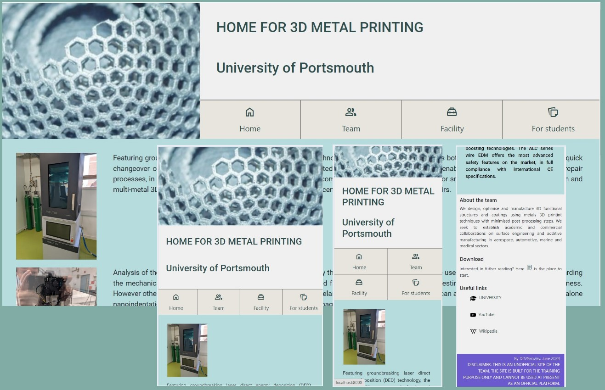<br>

## INTRODUCTION

Welcome to the 'Home for 3D' project. The projecs is the platform presenting informally and UNOFFICIALLY the 3d metal printing research group of the School of Mechanical Engineering, University of Portsmouth (UoP), UK. The purpose of the project is to facilitate interaction between the research staff of the Team and the students interested in learning more about the fascinating and explosively growing area of metal 3D printing (a.k.a. additive manufacturing). Are you interested? Here you can meet the key people, learn what they do. Do you have your own idea? Share it with us: sign-up and submit your proposal.

## TECHNOLOGIES

The following tools were used during the project setup and development:
- Static frontend: HTML, CSS, JavaScript
- Backend: Python
- Relational database: PostreSQL
- Frameworks: Django
- Libraries: Bootstrap, Google Fonts


## USER STORIES, PROJECT REQUIREMENTS

The project covers 5 user stories (put together after discussion with the members of the team in the University of Portsmouth).<br>
The next user stories met acceptance criteria and were moved to Done bucked of the kanban board:<br>
[User story 1](https://github.com/DrSYakovlev/home-for-additive/issues/1)<br>
[User story 3](https://github.com/DrSYakovlev/home-for-additive/issues/3)<br>
[User story 5](https://github.com/DrSYakovlev/home-for-additive/issues/5)<br><br>

User story 2 is carried over to the next sprint. User story 5 did not meet one acceptance criteria (- Confirm creating an account via e-mail or pop-up message) and was also moved to the back-log bucket.

[User story 2](https://github.com/DrSYakovlev/home-for-additive/issues/2)<br>
[User story 4](https://github.com/DrSYakovlev/home-for-additive/issues/4)<br>

In managing project requirements and user stories the MoSCoW prioritisation approach was applied giving the highest priority (must have) to the project pass criteria.

## FEATURES
The informative part describes the research group focusing on 3D metal printing. Therefore, it was decided to select cold, gray-ish color theme resembling the color of metal powder used for the process. The layout is responsive, depending on the device you use to access the content.
### Template
#### 1. Navbar
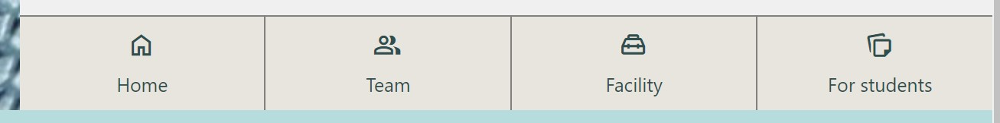<br>
Navigation bar on a regular pc screen.<br><br>
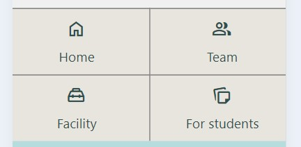<br>
Navigation bar on a mobile device.<br><br>
Navigation bar allows to navigate between:
- Home
- Team
- Facility
- For students<br>
tabs.
#### 2. Footer
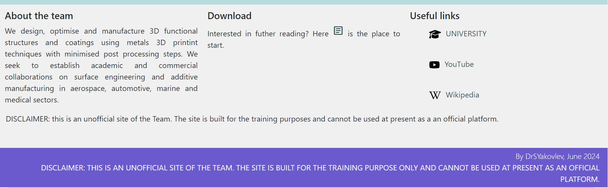<br>
Footer on tegular pc screen<br><br>
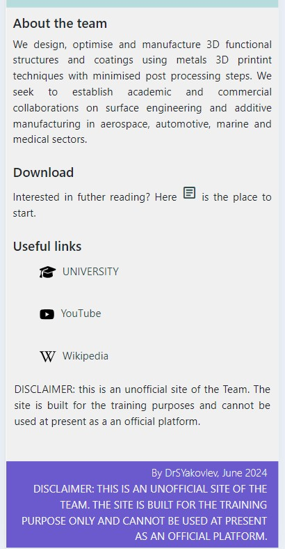<br>
Footer section as it renders on a mobile device.<br>
Footer contains brief description of the Group, useful links and 'further reading' link.
### Content
#### 1. Static content
'Home', 'Team', 'Facility' tabs: information about the group, expertise and available lab equipment.
#### 2. Dinamic content
Tab 'For students' will take you to the list of submitted proposals (also responsive).

## STRUCTURE
1. Home<br>
External links:<br>
 - Further reading
 - Youtube
 - University (Home)
 - Wikipedia<br>
2. Team<br>
Same external links as above via template.
3. Facility<br>
Same external links as above via template.
4. For Students<br>
List of proposed ideas<br>
Options: log in or sign in:<br>
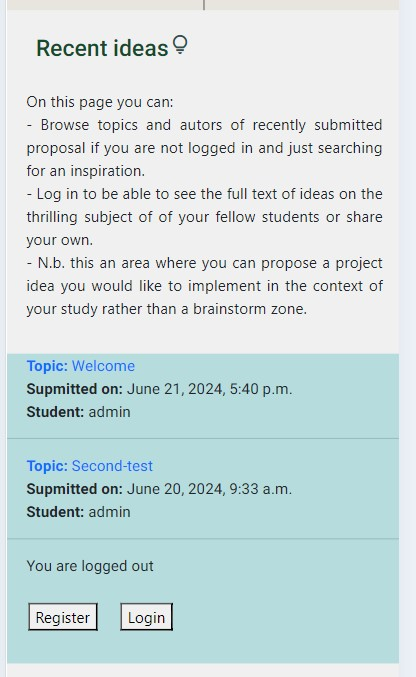<br><br>
If logged in or signed in:<br>
a. Can see any proposal
b. Can submit, edit and delete your own proposal<br>
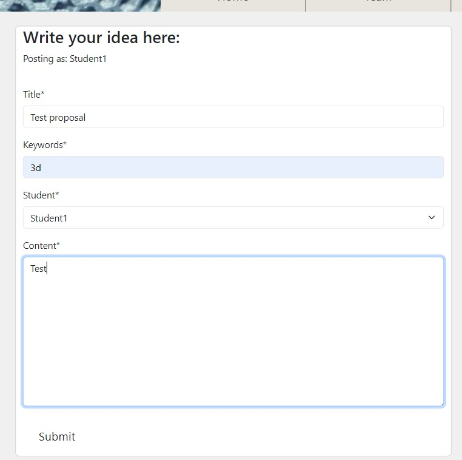<br>
Form for proposal submission/edit<br><br>
c. Log in status is shown<br>
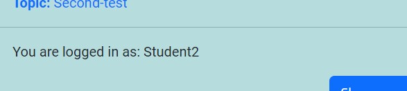<br>
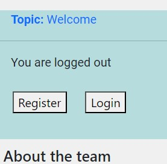<br><br>
If 'Delete proposal' option is selected, the user has a chance to confirm:<br>
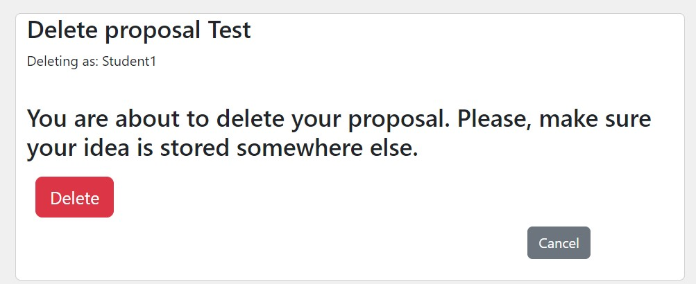<br><br>
If the user creates changes or deletes a proposal, notification message is shown and the user can navigate back to the list page:<br>
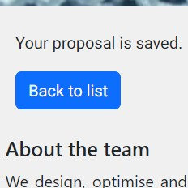<br>
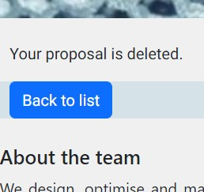<br>

## DATA MODEL
The database table (model) describing the structure of submitted proposals are shown below.<br>
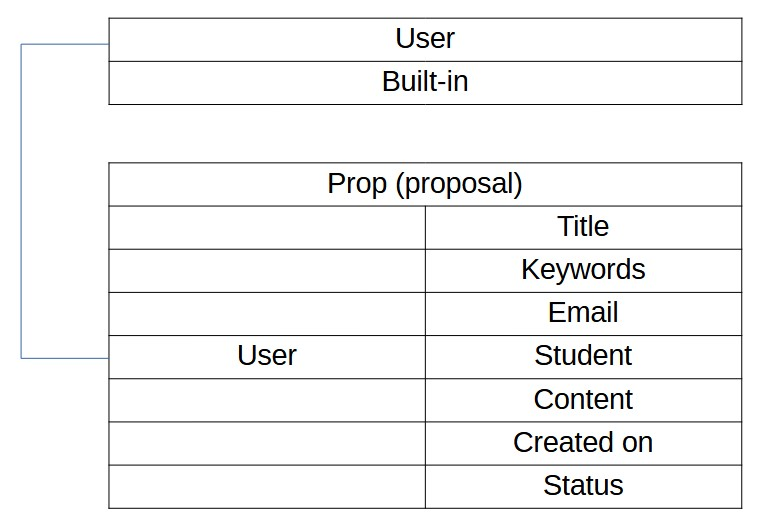


## ACCESS LEVEL RESTRICTION
- Access to an informative part of the site and the titles and student names: any visitor.
- Access to full text of all proposals: any registered and logged in student.
- Submit, edit and delete proposals: a particular student under his own credentials (can edit or delete his/her own proposals only).

## VALIDATION
HTML, CSS, Python and JS files were validated using W3C, Jigsaw, PEP8 CI Linter and jshint (respectively). Validation tests passed with no errors or warnings. The testable html code was accessed from rendered pages using the Ctrl-U key. The code then was copied into the direct input textfield of W3C validator.

## LIGHTHOUSE
Lighthouse test was run fro both the pc:<br>
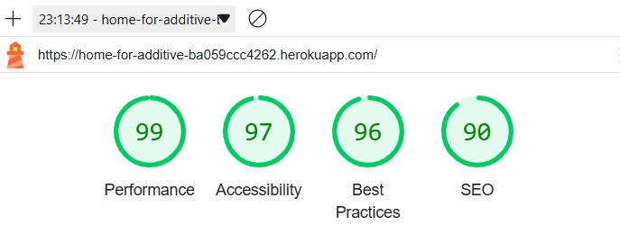<br>
and the mobile version:<br>
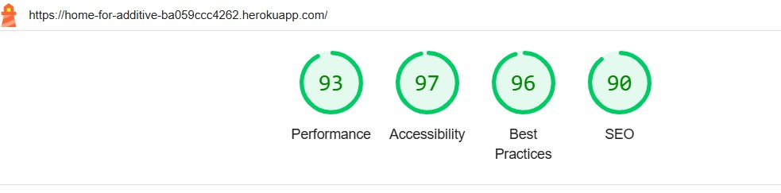
## MANUAL TESTING
Functionality of the deployed app was tested as follows:<br>
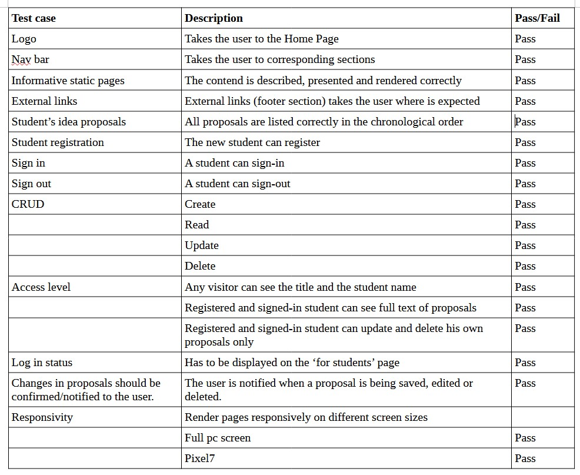

## DEPLOYMENT
<br>
!!! For production, the DEBUG key (settings.py) was set for False !!!


The project was deployed on [heroku.com](www.heroku.com). After creating the user account and heroku project the following steps were undertaken to deploy the project.
1. Install 
```gunicorn``` (version later than 20.1) and add to requirements.txt
2. Create 'Procfile' (project-level file, no filename extention)
3. In the Procfile declare ```web: gunicorn my_project.wsgi```
4. In settings.py, add ```.herokuapp``` to the list of ```ALLOWED_HOSTS```
5. Add, commit and push the code to GitHub
6. In Heroku, go to settings -> reveal config vars, create ```DATABASE_URL``` key and add the value corresponding to the PostreSQL database location
7. Under Heroku 'resources', check that no add-ons of Heroku database are added. Remove if there are some
8. In heroku project, go to 'deploy'
9. Click 'GitHub' button and nonnect GitHub repo to heroku project
10. Click 'Deploy' button to initiate manual deployment (the process can take few mins)
11. After receiving deployment confirmation, click 'open app' button
12. In Heroku, open the 'resources' tab and select 'eco dyno'

## BUGS (found after deployment)
One unfixed but was discovered after the deployment:
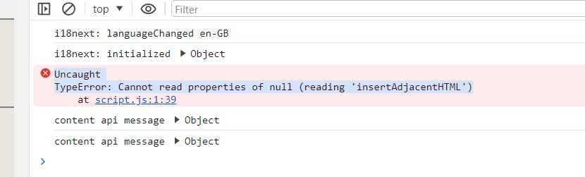<br>
The bug is associated with a custom script.js file. The file is responsible for formatting the 'new proposal' and 'edit proposal' forms and does-not affect functionality of the app.

## FUTURE WORK

This project was intended as fully functioning platform for communication, project submission and excange and equipment status/maintenance update within the 3D Metal Printing Group, School of Mechanical engineering, University of Portsmouth. The next functionality will be implemented after a formal approval of the group:<br>
- Registration approval vs student ID
- Add extra level of authorisation (provide team members with admin capabilities)
- System of approval of ideas for potential projects
- Equipment usage planner (can be done as a separate app)

### Acknowledgement
The code was written and debugged using the desktop version of VS Code. The aurthor thanks the School of Mechanical Engineering, University of Portsmouth for providing textual and picrorial content and the Code Institute for providing the template.

<hr>
<hr>

## HOME FOR 3D - REVISED

Below is the description of changes introduced into the revised version of the project.

### User stories and project requirements.

In the updated project, all five user stories are closed. In the previous version, two stories:

[User story 2](https://github.com/DrSYakovlev/home-for-additive/issues/2)<br>
[User story 4](https://github.com/DrSYakovlev/home-for-additive/issues/2)<br>

were left in the 'back-log' bucket. They are now labelled as 'done'

### Update on user stories

'Single proposal' page now has added 'If you are an ASSESSOR' button:

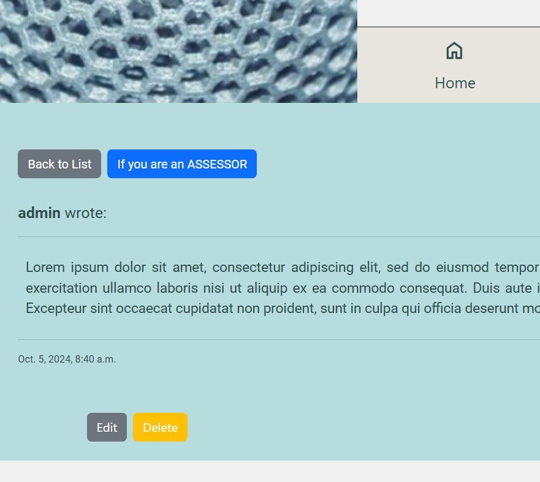

Which will take an assessor/supervisor to the commenting/marking page:

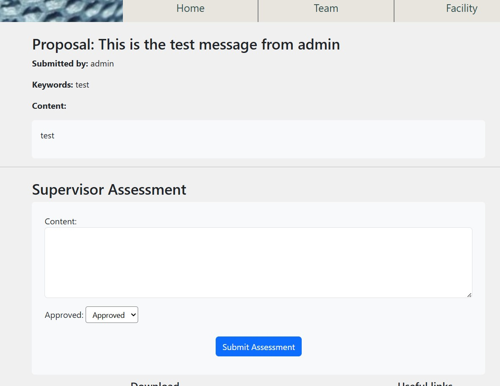

If the proposal has already been assessed, the next page will be generated instead:

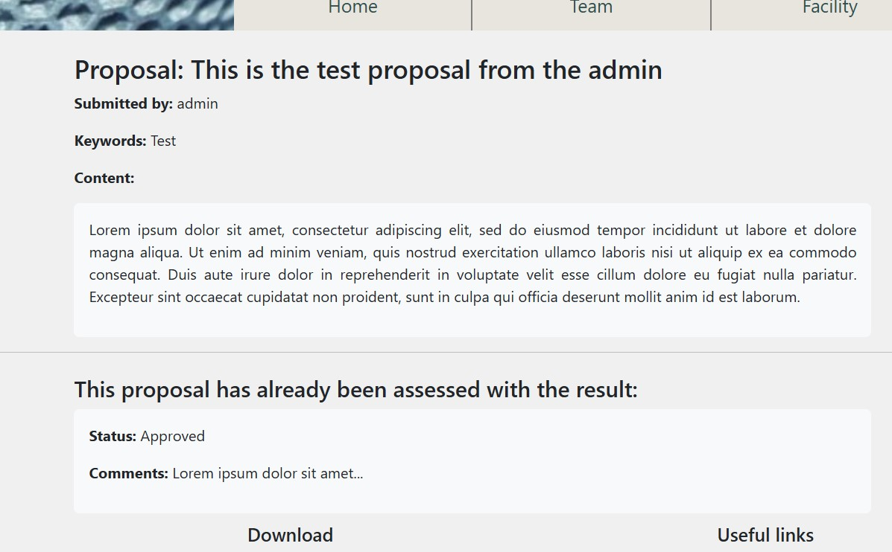


### User experience
In the revised version of the Project, the user experience was improved by:
1. Introducing the indicator of the log-in status of the current user (meeting user story [#2](https://github.com/DrSYakovlev/home-for-additive/issues/2)) (added to the  global base.html template):

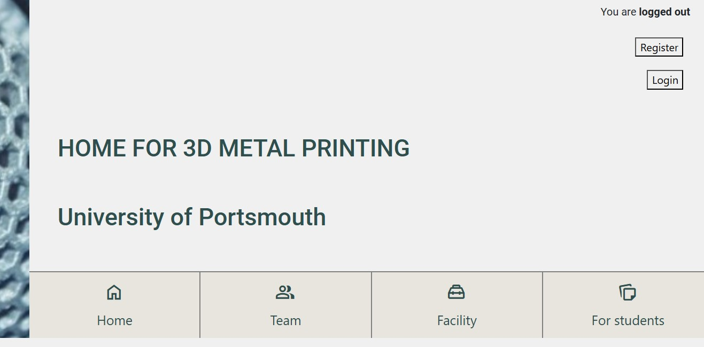

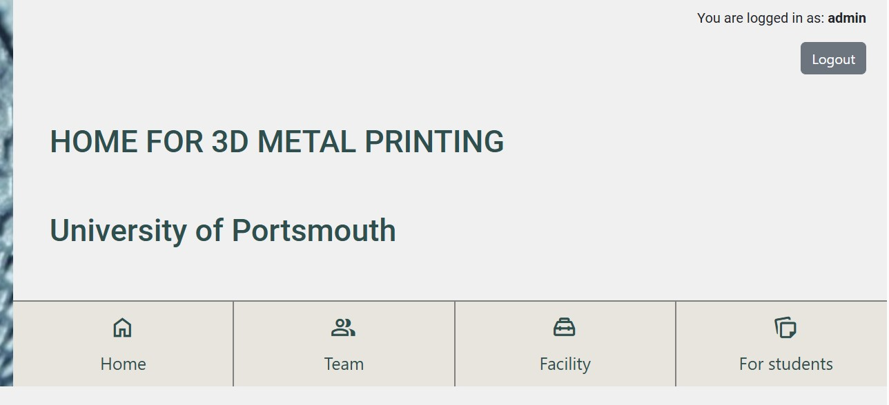

2. Improved log-in form formatting:

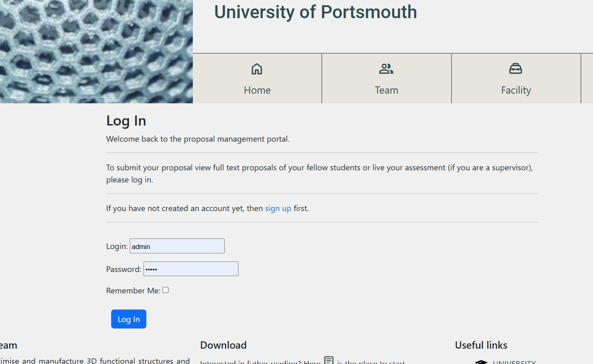

3. Improved 'confirm deletion' form formatting:

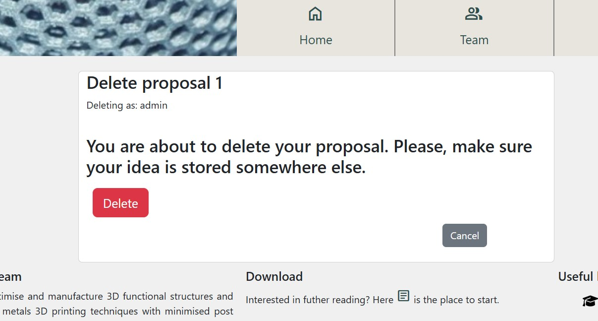

4. The app shows clear messages when proposal is created, updated or deleted:

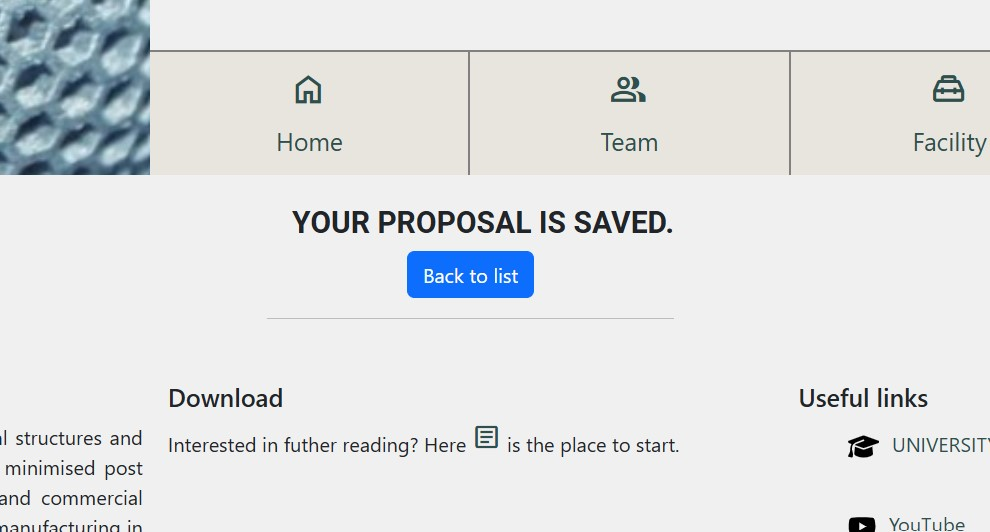

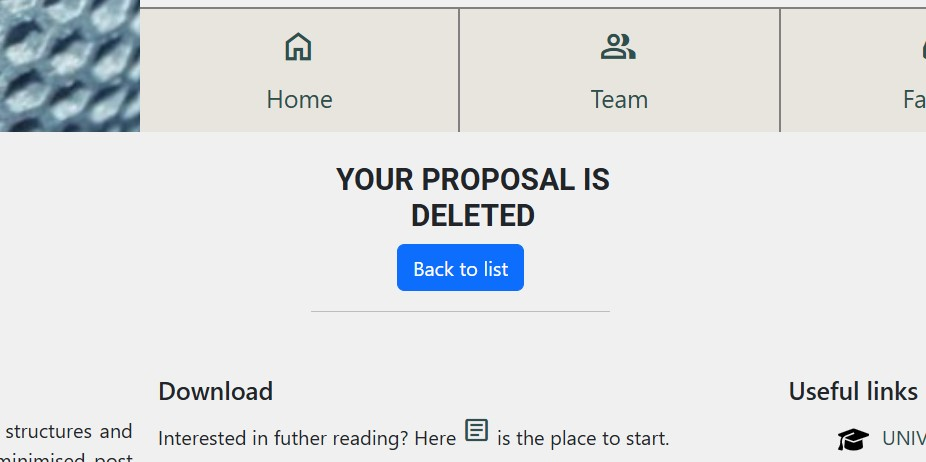


5. Navigation through the app is improved:
- The user now stays in 'For students' portal, instead of constantly being redirected to the 'home' page.


### Data model update

In order to meet business requirements for the user story [#4](https://github.com/DrSYakovlev/home-for-additive/issues/4), in this version, the Assessment model was added to the model. The new updated ERD is shown below:

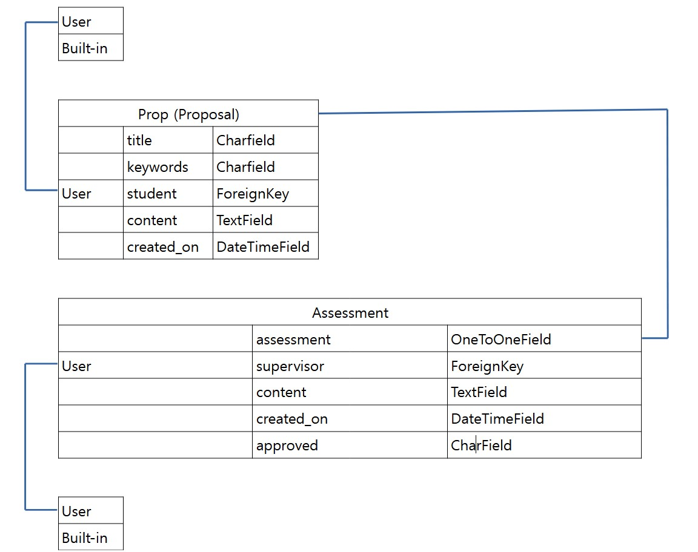

The Assessment table is related to the Prop via the one-to-one relation to ensure that each proposal can be assessed and commented once.

### Email notification

When a proposal is assessed, the email message should be generated and sent to the student:

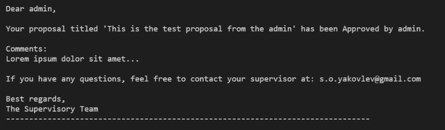

In the current(submitted) version, the email is shown in the console, according to:

```
EMAIL_BACKEND = 'django.core.mail.backends.console.EmailBackend'
```
setting (in [settings.py](https://github.com/DrSYakovlev/home-for-additive/blob/main/home_for_3d/settings.py))

to demonstrate that the code is functioning properly. For the 'real life' production, `smtp` service should be used. Below is an example of how the settings should be configured if you are planning to use Gmail:
```
EMAIL_BACKEND = 'django.core.mail.backends.smtp.EmailBackend'
EMAIL_HOST = 'smtp.gmail.com'
EMAIL_PORT = 587
EMAIL_USE_TLS = True
EMAIL_HOST_USER = 'your-email@gmail.com'
EMAIL_HOST_PASSWORD = 'your-app-password'  # App password if using 2FA
DEFAULT_FROM_EMAIL = 'your-email@gmail.com'
```
N.b. Do not use `console` and `smtp` simultaneously.

### Testing

Additional tests (see [list](#manual-testing) of tests performed on the previous version). New features were tested as follows:

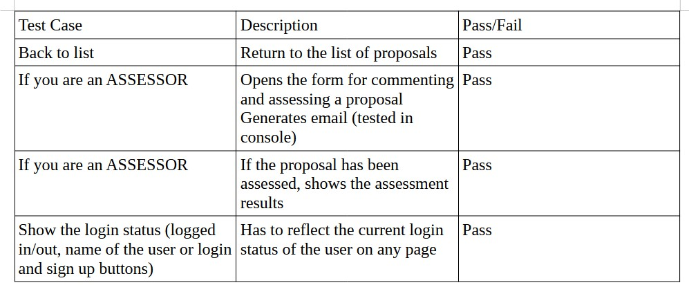


### Validation

***.py** Files:

Were validated using [CI Python Linter](https://pep8ci.herokuapp.com/) at the:

Project-level:

[settings](https://github.com/DrSYakovlev/home-for-additive/blob/main/home_for_3d/settings.py)

[urls](https://github.com/DrSYakovlev/home-for-additive/blob/main/home_for_3d/urls.py)

App-level:

[admin](https://github.com/DrSYakovlev/home-for-additive/blob/main/prop_for_3d/admin.py)

[apps](https://github.com/DrSYakovlev/home-for-additive/blob/main/prop_for_3d/apps.py)

[forms](https://github.com/DrSYakovlev/home-for-additive/blob/main/prop_for_3d/forms.py)

[models](https://github.com/DrSYakovlev/home-for-additive/blob/main/prop_for_3d/models.py)

[urls](https://github.com/DrSYakovlev/home-for-additive/blob/main/prop_for_3d/urls.py)

[views](https://github.com/DrSYakovlev/home-for-additive/blob/main/prop_for_3d/views.py)

With no errors found.

***.html** files were validated with [W3C validator](https://validator.w3.org/) with one [bug](#) found in Django-generated Sign-up form. Testable code was obtained by usins `Ctrl` - `U` key in the browser.

[style.css](https://github.com/DrSYakovlev/home-for-additive/blob/main/staticfiles/css/style.css) file was validated using the [Jigwaw](https://jigsaw.w3.org/css-validator/) validator with no errors detected.

#### Code validation bugs:
One bug found in Django-generated form:
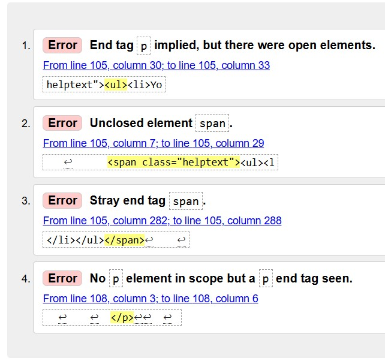
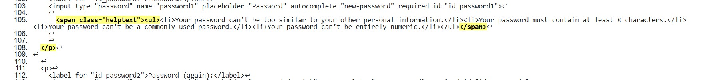


### Performance


The Lighthouse tool was used in the desktop mode. The results are shown below:
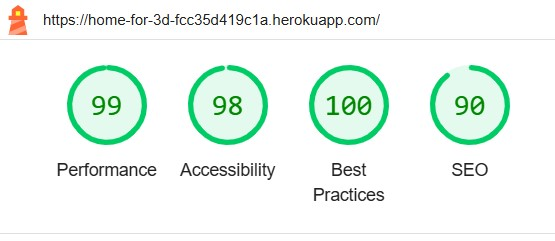

The updated version increased the score for accessibility and the best practices.

### Future work

* All the users and assessors should be approved by the Organisation.
* New uses and assessors must be members of a faculty. Their lists must be referred during the signing-up process.
* User names will be replaced by student ID numbers in the fufure.
* At the moment, any registered and logged in person can issue and assessment of a proposal. In future, only authorised person will have an access to this feature.

### Bugs fixed in the revised project
Solved the issue with image size transition discontinuity at 768 px (images could not be shown on 'team' and 'facility' pages at the transition between 'small' and 'medium')

Fixed the bug associated with a custom script.js file (Uncaught [TypeError](#bugs-found-after-deployment))


